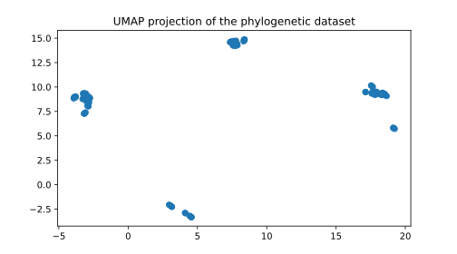
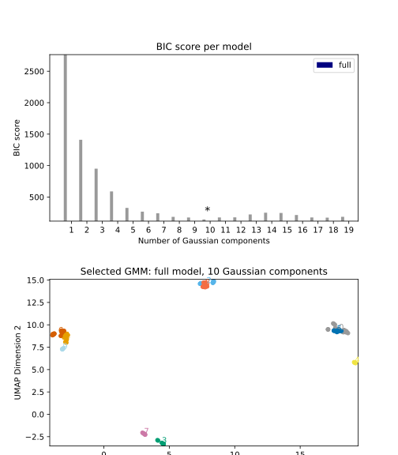
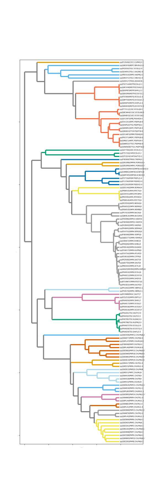

# Autophy

AutoPhy is a P


The primary home page for 

## Requirements and Installation

AutoPhy runs under Python 3 ( > 3.7, <=3.9)

You can install AutoPhy by running the following commands. To clone the repo:
```bash
git clone https://github.com/aortizsax/autophy.git
```

Change directory in to cloned repo:

```bash
cd autophy
```

Create the conda enviroment:

```bash
conda create -n autophy python==3.8
```

Activate conda enviroment:

```bash
conda activate autophy
```

Install repo as python package:

```bash
pip install .
```

Check build

```bash
autophy -h
```

In the future, you can update AutoPhy deleting the directory and rerunning this instalation. 

## Documentation

### Introduction
In the following section we will walk the user through the analysis using the OMP data outlined in the paper (DOI: ), as well as detailing where input your specific data  

### Your external data
For this analysis the user will need their alignment file in fasta format, tree in newick format, and two string identifiers (Family name or acronym; orinating database)


### Usage and Analysis

Usage:
```bash
autophy -h
```
returns:
```{bash}
usage: autophy [-h] [-t TREE] [-id TREEID] [-d DATABASE] [-H HEIGHT] [-o OUTPUT_SUFFIX]
               [-D OUTPUT_DIRECTORY]

optional arguments:
  -h, --help            show this help message and exit
  -t TREE, --tree TREE  Phylogenetic tree in Nexus or Newick with the same labels as alignment file
                        [default=../data/uniprotbeast/uniprotOMP_muscle_1647964589147_cah.tree].
  -id TREEID, --treeid TREEID
                        Protein family string indetifier [default=OMP].
  -d DATABASE, --database DATABASE
                        Database string indentifier [default=uniprot].
  -H HEIGHT, --height HEIGHT
                        Height of Biopython plot [default=22].
  -o OUTPUT_SUFFIX, --output-suffix OUTPUT_SUFFIX
                        Suffix for output files [default=umapgmmemm].
  -D OUTPUT_DIRECTORY, --output-directory OUTPUT_DIRECTORY
                        Suffix for output files [default=output].
```

To run:
```{bash}
cd data
autophy -t ../data/uniprotbeast/uniprotOMP_muscle_1647964589147_cah.tree -id OMP -d uniprot
```
Or for your data
```{bash}
autophy -t TREE.tree -id ID -d DATASET 
```

First UMAP projection. Parameters used 



Second, we fit Gaussian Mixture Model(GMM) using Expectation Maximization(EM) to the UMAP projection. GMM fits Gaussian peaks to any dimension. We score GMM models of increasing peak number using BIC score and pick the model with the lowest BIC score.




Third, in the case that when GMM peaks in the model pertain to paraphyletic clusters, we slpit those GMM peaks into simple monoplytic clusters and add a decimal at the end of the label so the user knows which GMM peak they originated from. Finally, the program prints the final clustered and colored tree 




## License and Warranty
Please see the file "LICENSE" for details.
